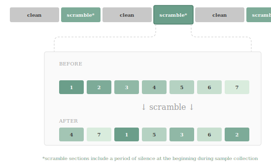

# Scrambler

A VCV Rack 2 plugin that alternates between clean passthrough and reordered sample windows of configurable size.



## Building

See https://vcvrack.com/manual/Building

```bash
export RACK_DIR=~/Rack-SDK
make install
```